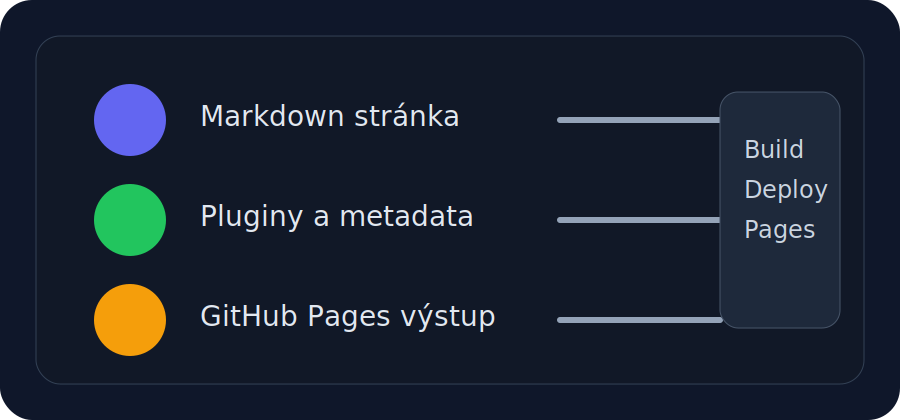

# Média a galerie

Obrázky v dokumentaci mají být lehké, ostré a dobře použitelné i na mobilu.

## Co je v core verzi připravené

- automatické lightbox zobrazení přes `glightbox`
- jednoduché obrázky a ilustrace
- prostor pro diagramy a screenshoty

## Doporučený přístup

- používej SVG pro ikony a jednoduché diagramy
- pro screenshoty drž rozumnou šířku
- přidávej popisky, aby bylo jasné, co obrázek ukazuje

## Ukázka

!!! tip
    Lightbox je nejpřínosnější u náhledů, screenshotů a schémat, která si čtenář potřebuje přiblížit.
